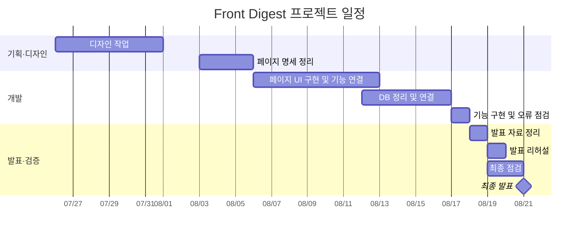

# 프다! (Front Digest)

> AI로 기술 문서를 요약하고, 요약노트·학습노트·퀴즈를 통해 개발 학습을 돕는 웹 서비스입니다.

---

- 과정명: 프로젝트 기반 프론트엔드 개발자 양성
- 프로젝트 차수: 3차 최종 프로젝트
- 팀명: 팀 입퇴실을 잘찍자

---

# 🔗 빠른 링크

- 📑 [기획서 (Figma Slide)](https://www.figma.com/deck/Eq27woTvOhyzFJxaFkv4uf)
- 🎨 [디자인 원본 (Figma)](https://www.figma.com/design/hMYcO7OqUssWszYBKqTiml/%EB%94%94%EC%9E%90%EC%9D%B8-%EC%8B%9C%EC%97%B0%EC%9A%A9?node-id=0-1&t=x4Js9vrivYtgng3g-1)
- 🌐[배포 서비스](https://est-fe13-final-project.vercel.app)
- 📑[기능 명세](./docs/specs)
- 📑[Supabase 개발 환경 안내](./supabase/README.md)
- 🤖[AI 개발환경 및 협업 가이드](./docs/AI-개발환경-및-협업가이드.md)

---

# 1. 프로젝트 개요

## 1.1 프로젝트 목표

개발자는 기술 문서와 학습 자료를 읽고 핵심 내용을 정리하는 데 많은 시간을 사용합니다. 프다는 이 과정을 AI 요약과 학습 기능으로 연결해 사용자가 핵심 내용을 빠르게 이해하고 반복해서 학습할 수 있도록 돕습니다.

본 프로젝트는 다음을 목표로 진행했습니다.

- 입력한 기술 주제를 AI 요약본으로 생성
- 생성된 요약본과 본문을 저장하고 공유
- 비밀번호를 통한 요약본 접근 보호
- 요약본 기반 학습노트 작성
- 퀴즈 풀이와 정답·해설 제공
- 북마크와 마이페이지를 통한 개인 학습 관리
- 데스크톱·태블릿·모바일 반응형 UI 제공

## 1.2 팀 구성

| 이름 | 역할 | 주요 담당 | GitHub | 연락 메일 |
| --- | --- | --- | --- | --- |
| 박소호 | 팀장 · 디자인·개발 | 레퍼런스 분석, Header·Mypage·Main 디자인 및 개발 | [soho1109](https://github.com/soho1109) | park1109pp@naver.com |
| 문송연 | 기획·디자인·개발 | 레퍼런스 분석, 회의록 작성, 기획 발표, 전체·내 요약노트, 북마크, 학습노트 레이아웃 | [ansthddus01-arch](https://github.com/ansthddus01-arch) | ansthddus01@gmail.com |
| 송민혁 | Git 관리·개발 | 레퍼런스 분석, Git 관리, 와이어프레임, 로그인·회원가입·완료 페이지, DB 구조 작성, OAuth 인증 구현 | [JEJU-Ratus](https://github.com/JEJU-Ratus) | smh1141@naver.com |
| 안건욱 | 개발 | 레퍼런스 분석, CRUD 기능 개발 | [agw76638](https://github.com/agw76638) | agw76638@gmail.com |

## 1.3 프로젝트 일정



## 1.4 개발 마일스톤

| 기간 | 마일스톤 | 주요 내용 |
| --- | --- | --- |
| 2026.07.26 ~ 08.01 | 기획·디자인 | 디자인 작업 및 개발 착수 |
| 2026.08.03 ~ 08.05 | 명세 정리 | 페이지별 기능 명세 및 구현 기준 정리 |
| 2026.08.06 ~ 08.12 | UI 구현·기능 연결 | 페이지 UI 구현, 공통 컴포넌트 연결 |
| 2026.08.12 ~ 08.16 | DB 정리·연결 | Supabase 테이블·권한 정책 정리 및 연결 |
| 2026.08.17 | 기능 점검 | 주요 기능 구현 및 오류 점검 |
| 2026.08.18 ~ 08.20 | 발표·최종 검증 | 발표 자료, 리허설, 최종 점검 |
| 2026.08.21 | 최종 발표 | 프로젝트 결과 발표 |

## 1.5 주요 사용자 흐름

```text
주제 입력
  → AI 요약 생성
  → 요약본 저장
  → 요약본 확인 및 북마크
  → 학습노트 작성
  → 퀴즈 풀이 및 복습
```

## 1.6 주요 기능

### AI 요약

- 메인 입력창에서 학습 주제 전송
- AI가 생성한 제목·요약 본문·퀴즈 저장
- 저장된 요약본 목록 및 상세 내용 제공

### 인증 및 사용자 관리

- Supabase 이메일·비밀번호 로그인
- Google·Kakao OAuth 로그인
- 회원가입 및 프로필 자동 생성
- 로그인·로그아웃과 접근 권한 관리

### 요약본 및 학습노트

- 공개 요약본 목록과 검색
- 비밀번호 잠금 요약본 지원
- 요약본별 학습노트 작성·수정·삭제
- 작성자 기준 퀴즈 생성 및 제출 상태 관리

### 개인 학습 관리

- 요약본 북마크
- 내 요약노트·내 북마크 조회
- 닉네임과 프로필 이미지 관리

## 1.7 구현 범위

### 공통 기능

- Header, Banner, CommonModal, Loading 구현
- 로그인·회원가입·회원가입 완료 페이지 구현
- 인증 Guard와 Supabase 세션 구조 구성

### 핵심 기능

- AI 요약 생성 및 Supabase 저장
- 요약본 목록·상세·비밀번호 접근 구현
- 학습노트 작성·수정·삭제 구현
- 퀴즈 제출·정답·해설·재제출 제한 구현

### 검증·배포

- 반응형 화면 확인
- 인증·권한·오류 처리 검증
- 제품 브랜치와 배포 브랜치 정리
- Vercel 배포 및 최종 QA

---

# 2. 개발 환경 및 배포

## 2.1 개발 스택

### Frontend

- Next.js App Router
- React
- JavaScript
- SCSS 및 SCSS Module

### Backend 및 서비스

- Supabase Auth
- Supabase Database
- Supabase Storage
- Vercel

### Tools

- Git / GitHub
- Figma
- VS Code
- Spec Kit
- Codex, Claude, Copilot

## 2.2 반응형 기준

- Desktop: 1320px
- Tablet: 1024px
- Mobile: 480px


# 3. 프로젝트 구조

```text
est_fe13_final_project/
├── docs/specs/                 기능·페이지 명세
├── public/images/              이미지·아이콘 리소스
├── specs/                      Spec Kit 산출물
├── src/
│   ├── app/
│   │   ├── (site)/             실제 서비스 페이지
│   │   ├── (dev)/              개발 확인용 페이지
│   │   └── auth/               OAuth·이메일 인증 처리
│   ├── components/             공통 React 컴포넌트
│   ├── lib/supabase/            Supabase 클라이언트
│   └── styles/                  전역 SCSS·공통 변수·믹스인
├── supabase/                   Supabase CLI 설정 및 안내
├── AGENTS.md                   프로젝트 개발 규칙
├── CLAUDE.md                   AI 작업 규칙
├── next.config.mjs             Next.js 설정
├── package.json                의존성 및 실행 스크립트
└── README.md
```

실제 서비스 페이지는 `src/app/(site)`에서 관리하고, `src/app/(dev)`는 컴포넌트와 기능을 확인하기 위한 개발용 페이지로 사용합니다.

---

# 4. 향후 개선 사항

- AI 요약 품질 및 프롬프트 개선
- 학습 통계와 개인별 학습 현황 제공
- 사용자 맞춤 학습 주제 추천
- 난이도별 퀴즈와 추가 문제 생성
- 프로필 이미지 업로드 및 Supabase Storage 연동 강화
- 접근성·성능·SEO 지속 개선
- 배포 환경 모니터링 및 오류 추적

---

# 5. 제작 후기

## 팀원 한줄 회고

- **박소호**: Figma 디자인을 실제 웹 서비스로 구현하며 사용자 흐름을 고려한 UI 설계와 개발의 중요성을 배웠고, Next.js·Supabase·AI API 연동을 통해 실무형 기능 구현과 Git 협업 경험을 쌓았습니다.
- **문송연**: 공통 UI를 설계하고 데이터·사용자 상태를 함께 고려하며 검색, 북마크, 비공개 접근, 퀴즈 기능의 연결 구조를 이해할 수 있었습니다.
- **송민혁**: AI 요약부터 학습노트·퀴즈까지 학습 과정을 하나의 서비스로 연결하고 Supabase 인증·RLS·RPC를 적용하며 프론트엔드와 백엔드 데이터 흐름 및 협업 역량을 높였습니다.
- **안건욱**: AI를 활용한 개발 워크플로를 프로젝트에 직접 적용하며 CRUD 기능을 구현하고 개발 과정을 체계적으로 익혔습니다.

---

# 6. 기획 및 디자인 문서

## 기능 명세

- [페이지·기능 명세](./docs/specs)
- [Spec Kit 산출물](./specs)

## 디자인

- [기획서 (Figma Slide)](https://www.figma.com/deck/Eq27woTvOhyzFJxaFkv4uf)
- [디자인 원본 (Figma)](https://www.figma.com/design/hMYcO7OqUssWszYBKqTiml/%EB%94%94%EC%9E%90%EC%9D%B8-%EC%8B%9C%EC%97%B0%EC%9A%A9?node-id=0-1&t=x4Js9vrivYtgng3g-1)
- 화면별 디자인 링크는 각 기능 명세 문서에서 확인할 수 있습니다.

---

# 7. 미리보기

실제 서비스는 아래 배포 URL에서 확인할 수 있습니다.

[프다! 배포 서비스](https://est-fe13-final-project.vercel.app)
